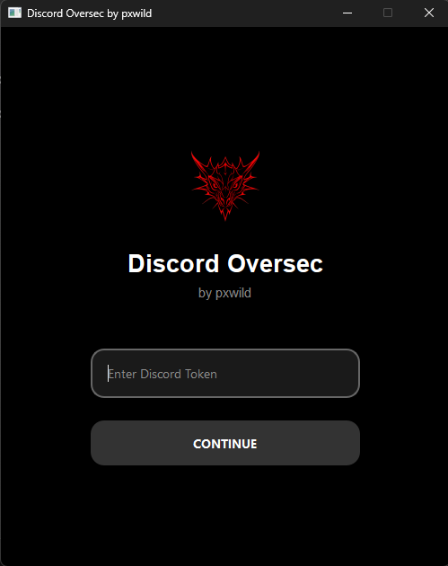
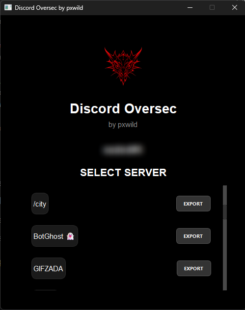

# Discord Oversec


**Discord Oversec** is a Python-based desktop application designed exclusively for **ethical learning purposes**. It allows users to extract and save Discord server messages into a structured JSON format for authorized educational analysis. This tool must only be used with explicit permission from server owners and in strict compliance with Discord's Terms of Service. Any unauthorized use is strictly prohibited, and users are solely responsible for their actions.

> **⚠️ Critical Notice**:  
> This software is proprietary to pxwild. Unauthorized copying, modification, distribution, decompilation, reverse engineering, or creation of derivative works is strictly prohibited without prior written permission from pxwild. Any attempt to misuse this tool, including unauthorized data extraction or violation of Discord's Terms of Service, may result in legal consequences, including account termination on platforms like GitHub or Discord. Use of this tool is entirely at your own risk, and you must ensure compliance with all applicable laws and platform policies.

## Screenshots

| Login Screen | Oversec Interface |
|--------------|-------------------|
|  |  |

## Features

- **User Authentication**: Securely authenticate using a Discord token.
- **Server Selection**: Easily select from a list of available Discord servers.
- **Data Extraction**: Extract messages from text channels in a structured JSON format.
- **Progress Tracking**: Real-time progress updates during data extraction.
- **Compressed Output**: Automatically compresses large datasets to save space.
- **User-Friendly Interface**: Built with PyQt6 for a smooth and modern user experience.

## Prerequisites

- Python 3.8 or higher

## Downloads

1. **Download the Source Code**: Obtain the `Oversec.py` file and any associated files from the official source provided by pxwild.
2. **Install Dependencies**:
   ```bash
   pip install PyQt6 aiohttp aiofiles
   ```
3. **Run the Application**:
   ```bash
   python Oversec.py
   ```

## Usage

1. **Launch the Application**: Run the script using `python Oversec.py` to open the Discord Oversec interface.
2. **Enter Discord Token**: Input your Discord token in the login screen.
3. **Select a Server**: Choose a server from the list of available servers.
4. **Export Data**: Click "EXPORT" to extract messages and save them to a JSON file.

## Ethical Use Statement

Discord Oversec is intended solely for **educational and ethical purposes**. It must only be used to analyze data from servers where you have explicit permission from the server owner. Any misuse, including unauthorized data extraction or violation of Discord's Terms of Service, is strictly prohibited. The developer (pxwild) is not responsible for any misuse of this tool or any consequences arising from its use.

## License

This project is licensed under a proprietary license. See the [source code](#) for full license details. Unauthorized use, modification, or distribution is prohibited.
